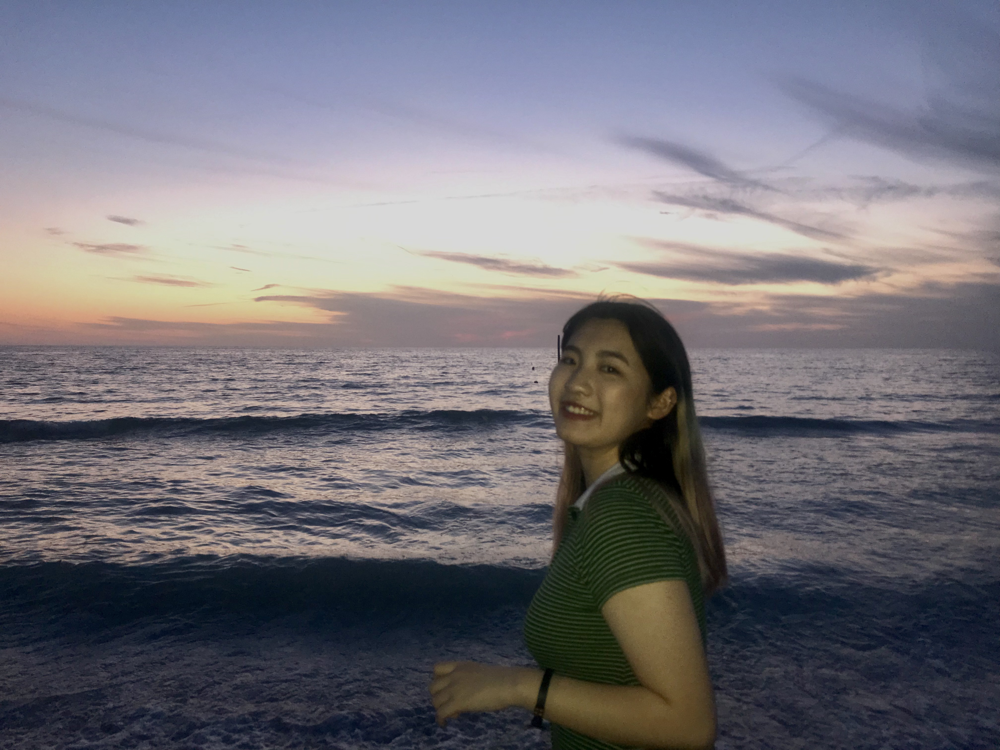

## More About Me 

 
I got my bachelor of science degree from Purdue University with a dual major in computer science and mathematics. During undergrad, I was trying to explore my interest and willing to learn more about computer science by conducting researches in different fields of studies. I have done research in [deep learning](https://dl.acm.org/doi/10.1145/3341162.3349330), [cryptography](https://barc-purdue.github.io/) and I have worked as a software engineer intern and quant developer intern. I have always considered programming skills as a tool, a tool to help me better communicate with the world, to understand, and to make a difference. Throughout the journey, there was a time I realized that I want to conduct further study in Human-Computer Interaction.  
 
It was in the last year of my college, I worked with a Professor from Purdue Krannert School of Management to build a website to help users find a perfect nursing home for their family with the information related to COVID-19. I did a lot of researches in the nursing home system, including what aspects are needed when evaluating a nursing home, the relationship between government, nursing home and hospitals, what people's concerns are when it comes to a nursing home. During the analyzing process, I found that I enjoy designing things, building everything from scratch. And it is also the time I realized that I care more about users, about human beings than just pure models or products. After that, I applied to Columbia University and chose the concentration in Vision, Graphic, and Interaction.  
 
As a female working in the tech industry, I am always acknowledged that women in the workplace have been facing gender inequality throughout history. It was the summer of 2021 when I decide to stand up in this situation. I made a post on Douban and gathered a group of amazing, outstanding, strong females to work with me towards this same goal. That's where Seeker starts. We are in the process of launching an online community for women in the workplace where females can freely express themselves, protect their rights, help each other and grow all together. We seek to bring up awareness of female-friendliness and help females to fight for themselves by creating a safe space for everyone. Working part-time with people from all over the world is not easy, but I am so grateful that I get to know all these beautiful human beings throughout this journey and Seeker would be a lifelong project for me.  
 
While working on Seeker, I realized that product mangement is the career I want to pursue. That thought was certained after one summer working as a product manager intern at Shopshops. I felt motivated when trying to understand the users, thinking about what could be improved and seeing the real result after implemented some changes. Now, I am working as an Associate Product Manager at Access Development, still feeling inspried every single day when I get to think and learn.

 
I will always be a researcher, innovator, problem-solver no matter what field I am in.